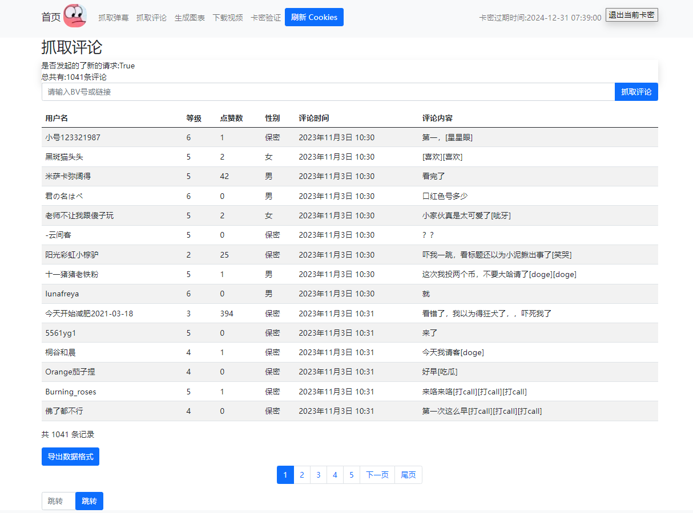

# 项目名称

bili_scrapy

## 简介

一个可视化的抓取b站弹幕和评论的爬虫项目~

## 运行环境

python3.10

## 安装依赖

```bash
pip install -r requirements.txt -i https://pypi.tuna.tsinghua.edu.cn/simple
```

## 配置数据库信息

将`settings.py`中的数据库配置修改为你自己的即可。

## 创建数据库表

```bash
py./manage.py makemigrations
py./manage.py migrate
```

## 初始化数据库

```bash
py ./manage.py makemigrations
py ./manage.py migrate
```

## 启动项目

```bash
py ./manage.py runserver
```

访问本地[```地址```](http://127.0.0.1:8000/bilibili/danmaku.html)

## 演示效果


### 弹幕结果图


### 评论结果图



### 汇总结果图

